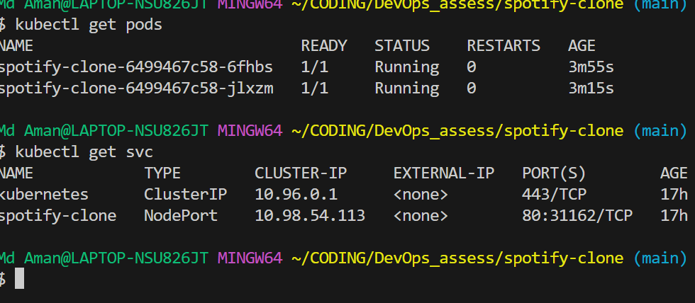

# 🎵 Spotify Clone — DevOps Assessment 

A Next.js 15 application bootstrapped with create-next-app, featuring a custom music player, containerized with Docker, and deployed to Kubernetes via GitHub Actions.



## 🛠️ Tech Stack 

- **Frontend Framework**: Next.js (React) 
- **Styling**: Tailwind CSS 
- **Audio Player**: HTML5 `<audio>` + React hooks + Visualizer 
- **Containerization**: Docker (multi-stage build) 
- **CI/CD**: GitHub Actions 
- **Orchestration**: Kubernetes (Minikube) 
- **Registry**: GitHub Container Registry (GHCR) 

## 🎶 Music Player Features 

- Play, pause, skip next/previous tracks 
- Shuffle & repeat functionality 
- Volume control 
- Seek bar with live progress updates 
- Audio visualizer with animated bars 
- Music categories: 
  - Lo-Fi 
  - Electronic 
  - Jazz 
  - Rock 
  - Classical 
  - All Music 
- Responsive grid layout of songs with album covers and hover play buttons 
- Songs are served from public/songs/ 

Make sure your MP3 files are placed in public/songs/ and images in public/images/.

## 🚀 Running Locally 

Install dependencies 
```bash
npm install 
# or 
yarn 
```

Run development server 
```bash
npm run dev 
# or 
yarn dev 
```

Open [http://localhost:3000](http://localhost:3000) in your browser.

Click any song to start playback. The player appears at the bottom.

## 🐳 Docker Containerization 

This app uses Docker multi-stage build for optimized image size.

Build Docker image 
```bash
docker build -t spotify-clone . 
```

Run container 
```bash
docker run -p 3000:3000 spotify-clone 
```

Then open [http://localhost:3000](http://localhost:3000).

## ⚙️ GitHub Actions CI/CD 

Automates: 
- Building the Docker image on push to main 
- Pushing the image to GitHub Container Registry (GHCR) 
- Tagging the image with: 
  - Commit SHA 
  - Branch name 
  - latest for default branch 

Prerequisites: 
- Enable GitHub Actions in your repository 
- Ensure GHCR permissions are configured (default GITHUB_TOKEN works) 

Example workflow snippet: 

```yaml
name: Build & Push Docker 

on: 
  push: 
    branches: 
      - main 

jobs: 
  build-and-push: 
    runs-on: ubuntu-latest 
    steps: 
      - uses: actions/checkout@v3 
      - name: Set up Docker Buildx 
        uses: docker/setup-buildx-action@v2 
      - name: Log in to GHCR 
        uses: docker/login-action@v2 
        with: 
          registry: ghcr.io 
          username: ${{ github.actor }} 
          password: ${{ secrets.GITHUB_TOKEN }} 
      - name: Build & push Docker image 
        uses: docker/build-push-action@v5 
        with: 
          context: . 
          push: true 
          tags: ghcr.io/Md-Aman45/spotify_clone:latest 
```

## ☸️ Kubernetes Deployment (Minikube) 

Prerequisites: 
- Minikube 
- kubectl 

Steps: 

Start Minikube: 
```bash
minikube start 
```

Update the Docker image in k8s/deployment.yaml: 
```yaml
image: ghcr.io/Md-Aman45/spotify_clone:latest 
```

Apply Kubernetes manifests: 
```bash
kubectl apply -f k8s/ 
```

Check deployments and pods: 
```bash
kubectl get deployments 
kubectl get pods 
```

Access your app using NodePort: 
```bash
minikube service spotify-clone --url 
```

This will give a URL like http://192.168.xx.xx:31162. You can open it in your browser or share it with others in your local network.

Optional - Port Forwarding: 
```bash
kubectl port-forward svc/spotify-clone 3000:80 
```

Then access via [http://localhost:3000](http://localhost:3000).

Cleanup: 
```bash
kubectl delete -f k8s/ 
minikube stop 
```

## 📚 Learn More 

- [Next.js Documentation](https://nextjs.org/docs)
- [Tailwind CSS](https://tailwindcss.com/docs)
- [Docker Docs](https://docs.docker.com/)
- [GitHub Actions Docs](https://docs.github.com/en/actions)
- [Kubernetes Docs](https://kubernetes.io/docs/home/)

## 🧠 Author 

Md Aman

Email: aman9534577@gmail.com

GitHub: [@Md-Aman45](https://github.com/Md-Aman45)

LinkedIn: [Md Aman](https://www.linkedin.com/in/md-aman-7941a0355/)


✅ This version includes:  

- Badges for GitHub Actions and Docker pulls  
- Table of Contents  
- All sections (Tech Stack, Music Features, Local Setup, Docker, CI/CD, Kubernetes, Learn More, Author)  
- Proper code blocks for commands and YAML  

---

If you want, I can also **add screenshots of the music player and visualizer** to make the README look professional for GitHub.  

Do you want me to add that?
